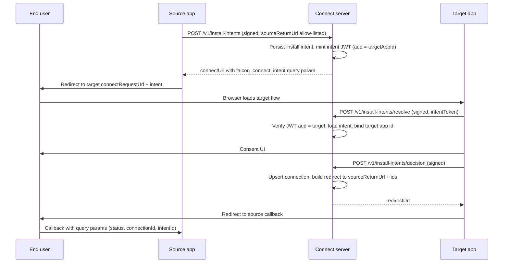

# FALCON Connect — security review (25 March 2025)

**Repository commit reviewed:** `b896a79ce6833e5d92c7b2499d26dd1c29aa96f7`  
**Branch:** `cursor/connect-security-review-cb25`

This document is a **report-only** review. No production code was changed as part of producing it.

## Executive summary

FALCON Connect separates **dashboard user sessions** (Better Auth, ORPC `protectedProcedure`) from **partner traffic** (`POST /v1/*`), which is authenticated with **Ed25519-signed requests**, **nonce replay suppression**, and **JWTs** for install intents and connection access. The design has several strong properties (target-bound install intent JWT audience, source return URL allow-listing, connection row checks keyed off the authenticated app id).

The highest risks in the reviewed tree are **operational and cryptographic**: a **hardcoded fallback Falcon signing private JWK** and **hardcoded demo Ed25519 private keys** ship in source; if those patterns reach production or are copied by integrators, **full token forgery and impersonation** of any registered trusted app is possible. Separately, **`introspectConnection` treats an arbitrary `connectionToken` as trusted** after only `decodeJwtUnsafe` — any party that can obtain or guess a valid `connectionId` can get an “active” introspection result for tokens they did not prove possession of.

Secondary issues include **signed-request canonicalization that ignores scheme/host** (proxy/host-header confusion class), **unbounded nonce table growth**, **dashboard IDOR on connection status updates**, **broad ops read APIs for any authenticated user**, **install intent JWTs in query strings** (referrer/log leakage), **verbose Zod validation errors** on the wire, and **demo apps** that embed private keys, use `localStorage`, and expose token-handling HTTP endpoints.

## Threat model

### Assumed actors and goals

| Actor | Goals |
| --- | --- |
| **Malicious target or source app** | Trick users, steal or replay tokens, escalate scopes, confuse roles (act as the other party), abuse APIs reachable with a stolen or borrowed signing key. |
| **Network attacker** | MITM on cleartext or mis-terminated TLS, inject or rewrite traffic, harvest tokens from URLs or logs, abuse permissive CORS if misconfigured. |
| **Cross-site attacker** | Abuse cookies, CSRF on partner or dashboard surfaces, open redirects if callback URLs are too loose, `postMessage` issues if introduced later (not observed in core Connect flow). |
| **Compromised or careless integrator** | Copy demo code with embedded keys, disable verification “temporarily,” log tokens, store JWTs in `localStorage`. |
| **Authenticated dashboard user** | Enumerate or mutate objects they should not (IDOR), scrape ops data, abuse `updateConnectionStatus` without app-level authorization. |
| **Anonymous client** | Call only what is public (`healthCheck`, auth); partner `/v1/*` requires valid app signatures. |

### Trust boundaries

- **Connect server** may assert: trusted app registry rows, install intent and connection lifecycle state, issuance of Falcon-signed JWTs, and enforcement of signing + nonce rules for `/v1/*`.
- **Clients must cryptographically verify**: connection access JWTs via JWKS (`jose` remote JWKS + `iss`/`aud`), and **must not** treat introspection alone as proof of possession unless the API is fixed to verify the token or bind proof (see [FC-SEC-003](/docs/reviews/security/25-03-2025/FC-SEC-003-introspection-token-not-verified)).
- **User consent** is enforced in the **target app UI**; Connect records the outcome and scopes but does not authenticate end users.

## Data flow (connection established)

## Crypto sign / verify pairs (invariants)

| Operation | Sign | Verify | Intended invariant |
| --- | --- | --- | --- |
| Partner HTTP request | `signFalconAppRequest` / `createFalconAppAuthHeaders` in `@falcon/sdk` (`packages/sdk/src/crypto.ts`) | `verifyFalconAppRequest` + DB nonce uniqueness in `authenticateTrustedAppRequest` (`packages/api/src/connect.ts`) | Only holders of a registered active key for `appId` can call `/v1/*`; nonce replays rejected. |
| Install intent JWT | `signInstallIntentToken` (`packages/sdk/src/crypto.ts`), server uses Falcon signing key | `jwtVerify` in `verifyInternalInstallIntentToken` (`packages/api/src/connect.ts`) | Token was minted by Connect; `aud` binds token to target app id; `resolveInstallIntent` checks `intentRow.targetAppId === auth.app.id`. |
| Connection access JWT | `signConnectionAccessToken` | Target verifies via `verifyConnectionAccessToken` (`packages/sdk/src/crypto.ts`) against `/.well-known/jwks.json` | Runtime bearer proves connection id, parties, subject, org, scopes until expiry; **issuer string must match deployed Connect URL** (`verifyConnectionToken` uses `baseUrl` as `issuer`). |

**Gap:** introspection path verifies the **caller’s** app signature but not the **connection token’s** signature ([FC-SEC-003](/docs/reviews/security/25-03-2025/FC-SEC-003-introspection-token-not-verified)).

## Findings table

| ID | Title | Severity | Area | CWE |
| --- | --- | --- | --- | --- |
| [FC-SEC-001](/docs/reviews/security/25-03-2025/FC-SEC-001-hardcoded-falcon-signing-key) | Hardcoded fallback Falcon Connect signing key | **CRITICAL** | api / crypto | CWE-798 |
| [FC-SEC-002](/docs/reviews/security/25-03-2025/FC-SEC-002-hardcoded-demo-app-keys) | Hardcoded demo trusted-app private keys in repo and DB bootstrap | **CRITICAL** | api / apps | CWE-798 |
| [FC-SEC-003](/docs/reviews/security/25-03-2025/FC-SEC-003-introspection-token-not-verified) | Introspection accepts `connectionToken` without cryptographic verification | **HIGH** | api / protocol | CWE-345 |
| [FC-SEC-004](/docs/reviews/security/25-03-2025/FC-SEC-004-sdk-introspection-fallback-decodeJwtUnsafe) | SDK introspection fallback uses `decodeJwtUnsafe` | **HIGH** | sdk | CWE-347 |
| [FC-SEC-005](/docs/reviews/security/25-03-2025/FC-SEC-005-signed-request-host-not-bound) | Request signing canonical string omits scheme and host | **MEDIUM** | sdk / api / protocol | CWE-444 |
| [FC-SEC-006](/docs/reviews/security/25-03-2025/FC-SEC-006-nonce-replay-store-growth) | Nonce replay table grows without TTL cleanup | **MEDIUM** | db / api | CWE-400 |
| [FC-SEC-007](/docs/reviews/security/25-03-2025/FC-SEC-007-dashboard-connection-status-idor) | Dashboard can update any connection by id | **HIGH** | api / auth | CWE-639 |
| [FC-SEC-008](/docs/reviews/security/25-03-2025/FC-SEC-008-ops-surface-data-exposure) | Ops ORPC procedures expose registry and activity to any logged-in user | **MEDIUM** | api / auth | CWE-200 |
| [FC-SEC-009](/docs/reviews/security/25-03-2025/FC-SEC-009-install-intent-token-in-url) | Install intent JWT passed in query string | **MEDIUM** | protocol / apps | CWE-598 |
| [FC-SEC-010](/docs/reviews/security/25-03-2025/FC-SEC-010-validation-error-detail-leakage) | Zod validation errors returned verbatim to clients | **LOW** | api | CWE-209 |
| [FC-SEC-011](/docs/reviews/security/25-03-2025/FC-SEC-011-demo-insecure-reference-patterns) | Demo apps embed secrets and unsafe token UX | **HIGH** | apps | CWE-798 |
| [FC-SEC-012](/docs/reviews/security/25-03-2025/FC-SEC-012-source-callback-query-unauthenticated) | Source callback trusts query parameters without binding | **MEDIUM** | apps / protocol | CWE-345 |
| [FC-SEC-013](/docs/reviews/security/25-03-2025/FC-SEC-013-no-rate-limit-on-v1) | No rate limiting on partner `/v1` API | **MEDIUM** | api / infra | CWE-400 |

## Residual risk

After addressing CRITICAL/HIGH items, residual risk remains in: **end-user phishing** at the target consent UI, **TLS and deployment configuration** (CORS, cookie flags, HSTS), **integrator misuse** of `allowIntrospectionFallback`, and **supply-chain** dependencies (`jose`, Better Auth). JWKS URL pinning and key rotation policies should be documented for operators.

## Prioritized hardening backlog

1. Remove or gate all hardcoded private keys; fail closed if `FALCON_CONNECT_SIGNING_PRIVATE_JWK` is unset outside explicit dev mode.
2. Fix `introspectConnection` to `jwtVerify` connection tokens (or reject `connectionToken` until it can be verified) and align SDK fallback behavior.
3. Bind signed requests to absolute URL or a server-chosen base URL; document reverse-proxy requirements.
4. Add nonce (or audit row) retention job and monitoring.
5. Scope `updateConnectionStatus` and ops APIs by role/tenant; never use placeholder actor ids for audit.
6. Replace query-string intent delivery with POST-based or fragment-based patterns where possible.
7. Redact or normalize validation errors in production.
8. Add edge or middleware rate limits for `/v1/*` ([FC-SEC-013](/docs/reviews/security/25-03-2025/FC-SEC-013-no-rate-limit-on-v1)).

## OWASP ASVS mapping (informative)

Not a full ASVS audit. Notable gaps vs **ASVS V2/V3/V4** themes: **V2.10** (anti-automation / rate limits) not evident on `/v1/*`; **V4.1** (encoding and canonicalization) partially addressed for signing but host binding weak; **V4.2** (trusted service layer) undermined if introspection skips token verification; **V9.1** (communications integrity) depends on TLS + signing; **V14.4** (unmanaged secrets) violated by hardcoded keys. Target **Level 2** for a multi-tenant control plane would require closing the HIGH/CRITICAL items above.

## Individual findings

Each finding is a separate page under this folder with severity, confidence, impact, evidence, and mitigations.
